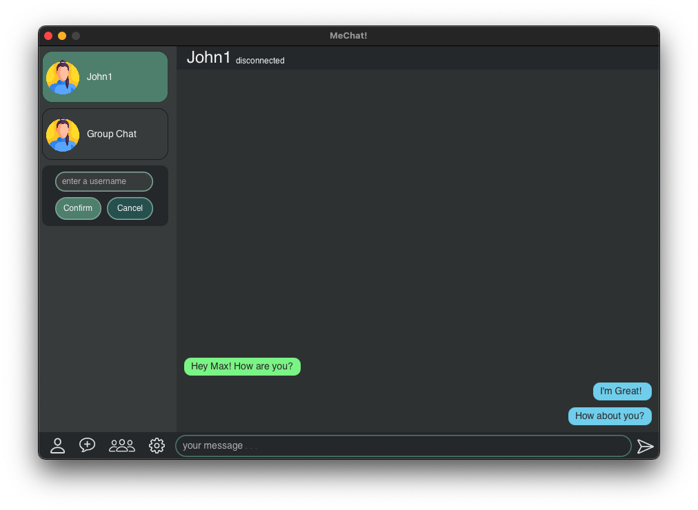
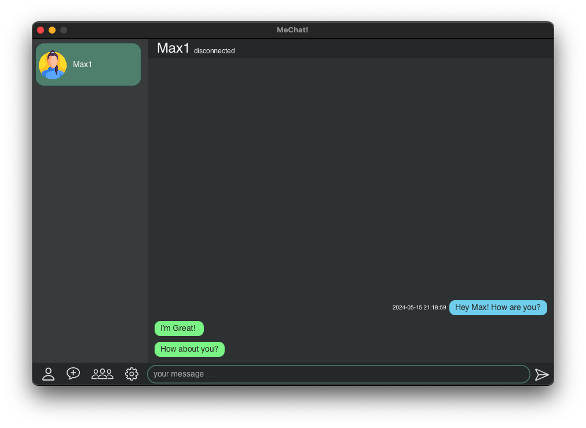
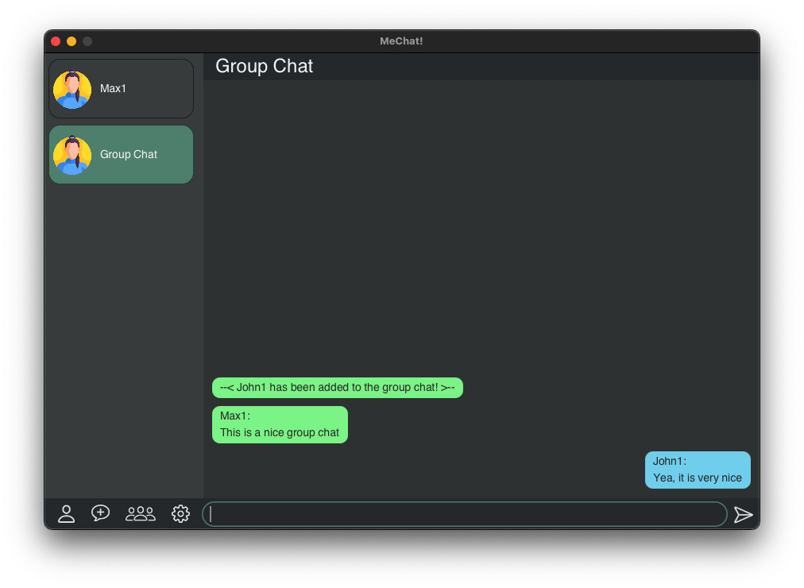
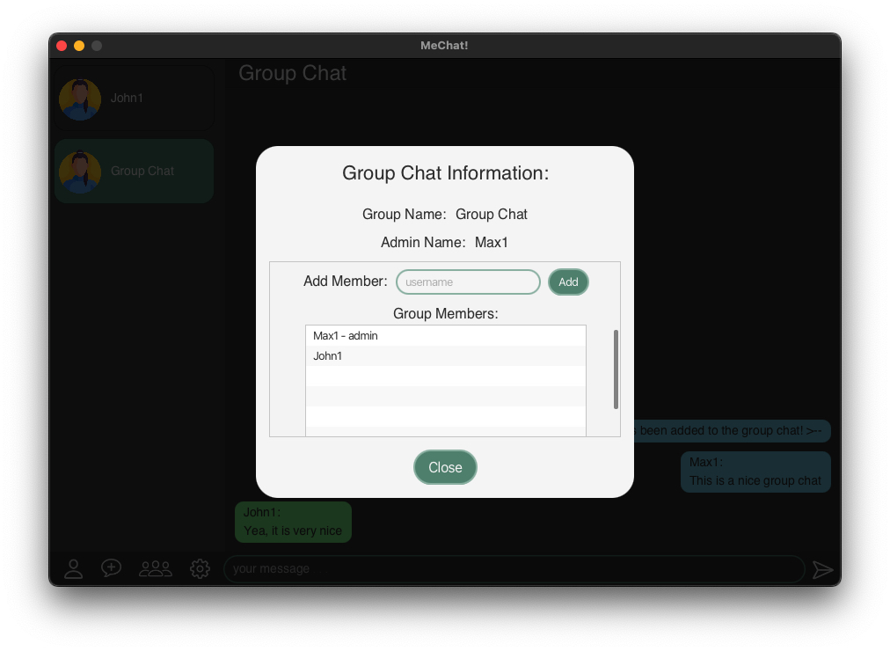
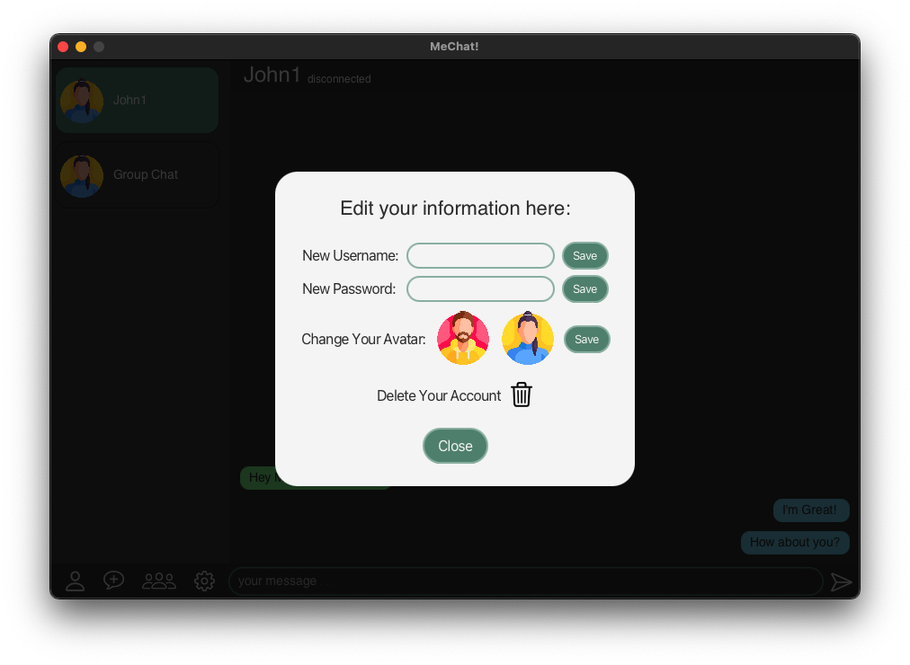

# MeChat! - Real-Time Chat Application

MeChat! is a real-time chat application that supports both 1-on-1 private messaging and group chats. Users can personalize their experience by changing their username, password, and choosing a user icon.

## Features

- **Real-Time Messaging**: Enjoy seamless real-time communication.
- **1-on-1 Chats**: Private messaging with individual users.
- **Group Chats**: Create and participate in group conversations.
- **User Management**: Add, remove, and manage users in group chats.
- **Customization**: Change username, password, and user icon for a personalized experience.

## Screenshots

### Create a New Chat

- Users can create chats with any existing user by typing their name.
- Users can open their own group chats in a similar way.

### 1-on-1 Chat Interface

- Users can engage in private, one-on-one conversations.
- Users can delete chats including the history for both patries.
  
### Group Chat Interface

- Users can participate in group chats.
- New users can be added to the group chat by the admin. 

### Group Chat Information

- The admin can add new members to the group chat and manage existing members.
- The admin can change the group chat name and icon.
- The admin can close the group chat (deletes that group chat for all members with an appropriate information message)

### User Settings Interface

- Users can change their username, password and user icon.
- Users can choose to delete their account and all the chats they ever had on the app.
  
## License

Distributed under the MIT License. See LICENSE for more information.

## Contact

Maxim Subotin - maxim.sub21@gmail.com

Project Link: https://github.com/MaxSubotin/MeChat

